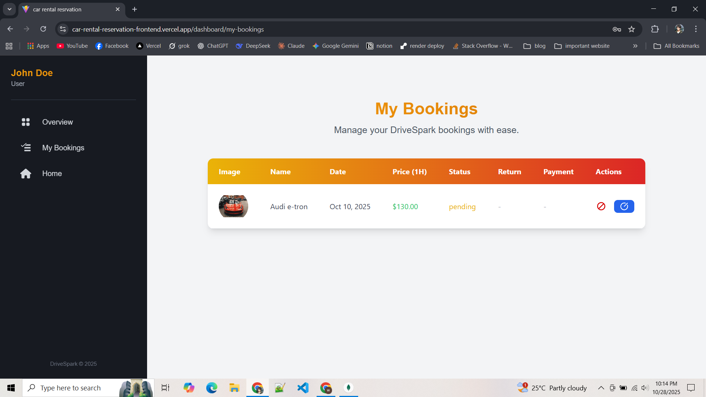

# 🚗 Car Rental Reservation System- A Drive Spark (Frontend)

- ### Live Site: https://car-rental-reservation-frontend.vercel.app

A modern, responsive, and user-friendly **Car Rental Reservation System** frontend built with **React, Vite, and TailwindCSS**.  
This platform provides seamless browsing, booking, and car management experiences for customers and admins, integrated with advanced features like secure payments and booking management.

---

## ✨ Features

### **Public Pages**

- **Home Page:**

  - Eye-catching hero banner with "Book Now" CTA.
  - Featured cars carousel/grid with price and description.
  - Customer testimonials and "Why Choose Us?" section.
  - Responsive header (Logo, navigation menu, login/signup buttons).
  - Informative footer (social media, terms, and policies).

- **Car Listing & Car Details Pages:**

  - Advanced filtering (car type, price range, features).
  - Car details with high-quality images, reviews, and add-on options (GPS, child seat).
  - "Book Now" button leading to the booking page.

- **About Us:**

  - Company history, mission, and vision.
  - Team profiles and fleet details.
  - Contact information (phone, email, address).

- **Error Pages (404 & API Errors):**
  - Customized 404 page with navigation options.
  - Display backend API error messages when no data is available.

---

### **User Authentication**

- **Sign Up:**
  - Real-time validation for email, passwords, and terms acceptance.
  - Redirect to dashboard on successful registration.
- **Sign In:**
  - Secure login with error handling for invalid credentials.
  - Redirect to dashboard on successful login.

---

### **Private Pages (User)**

- **User Dashboard:**

  - View and manage personal information and booking history.
  - Modify/cancel bookings (restrictions after approval).
  - Payment options after car return.

- **Booking Page:**
  - Search cars by location, date, type, and features.
  - Booking form with personal details (NID/Passport, Driving License).
  - Booking confirmation with summary details.

---

### **Private Pages (Admin)**

- **Admin Dashboard:**
  - Statistics: total bookings, available cars, revenue.
  - Car Management: Add, update, or delete cars (with image upload).
  - Booking Management: Approve, cancel, or track returns.
  - User Management: Block/unblock users, update roles (user/admin).

---

### **Bonus Features**

- **Payment Integration:**
  - Secure payment gateways (Stripe, AmarPay/SSLCommerz).
  - Payment after car return with detailed receipts.

---

## 🛠 Tech Stack

**Frontend Framework:** React (with Vite)  
**State Management:** Redux Toolkit, Redux Persist  
**Styling:** TailwindCSS, DaisyUI  
**Form Handling:** React Hook Form + Yup validation  
**Payment Integration:** Stripe React SDK  
**Date & Time:** Day.js  
**Charts & Visualization:** React ChartJS 2  
**Carousel:** React Slick & Slick Carousel  
**Icons:** React Icons, Heroicons  
**Notifications:** Sonner, SweetAlert2  
**Other Tools:** React Spinners, React Tooltip, React Image Gallery

---

## 🖼️ Project Screenshots

### Public Pages
<p align="center">
  
  
  
  
  
  
</p>

### User Dashboard
<p align="center">
  
  
</p>

### Admin Dashboard
<p align="center">
  
  
  
  
  
</p>


---

## 📦 Project Setup

### **1. Clone the Repository**

```bash
git clone https://github.com/your-username/car-rental-reservation-frontend.git
cd car-rental-reservation-frontend
```
